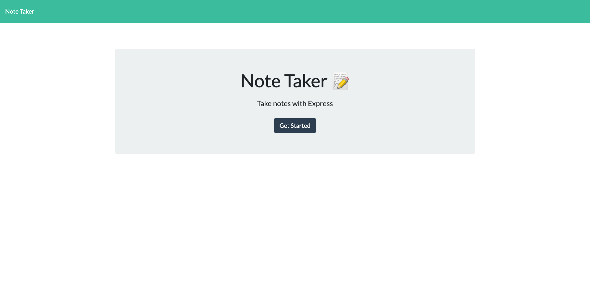
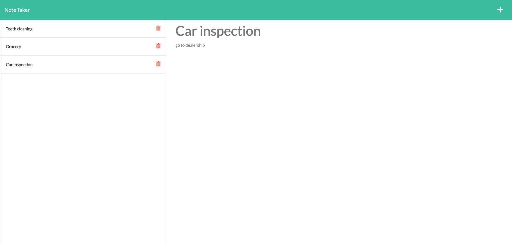

# NoteTaker

Create a note taking app that takes in a title and text for each note and displays them as entries on a menu. You can go back and click on a previously entered note to show the note and its contents. You can also delete a note by clicking on a trash icon that is present on each note. 

The app uses Express.js as the backend server, reads and saves from a JSON file, and is deployed using Heroku. 

## Description
*On page load the user is presented with the title page and a get started button. 

*Upon clicking the get started button, the user is presented with the contents of the previously saved notes (if there are any) on the left side of the screen. 

*New note form can be accessed by a plus button on the top right. Upon filling out the new note, the new note can be saved by a save button on the top right.

*Previously entered notes can be recalled by clicking on it. 

*Old notes can be deleted using the trash button on each entry. 

## Mock-up
The images below shows the webpage created

## Location
https://powerful-ridge-91611.herokuapp.com/

## Credits
Starter code provided by University of Texas Coding Bootcamp

## License
MIT License

Copyright (c) 2022 Teddy Wang

Permission is hereby granted, free of charge, to any person obtaining a copy
of this software and associated documentation files (the "Software"), to deal
in the Software without restriction, including without limitation the rights
to use, copy, modify, merge, publish, distribute, sublicense, and/or sell
copies of the Software, and to permit persons to whom the Software is
furnished to do so, subject to the following conditions:

The above copyright notice and this permission notice shall be included in all
copies or substantial portions of the Software.

THE SOFTWARE IS PROVIDED "AS IS", WITHOUT WARRANTY OF ANY KIND, EXPRESS OR
IMPLIED, INCLUDING BUT NOT LIMITED TO THE WARRANTIES OF MERCHANTABILITY,
FITNESS FOR A PARTICULAR PURPOSE AND NONINFRINGEMENT. IN NO EVENT SHALL THE
AUTHORS OR COPYRIGHT HOLDERS BE LIABLE FOR ANY CLAIM, DAMAGES OR OTHER
LIABILITY, WHETHER IN AN ACTION OF CONTRACT, TORT OR OTHERWISE, ARISING FROM,
OUT OF OR IN CONNECTION WITH THE SOFTWARE OR THE USE OR OTHER DEALINGS IN THE
SOFTWARE.